svg_plot
========

Plot data in SVG format using C++ library.

With just a few lines of C++ code, the SVG_plot C++ library allows plotting of data (held in STL containers like vector and map), to be output as Scalable Vector Graphic files that can be viewed by all modern browsers.

1D, 2D and Boxplots can be produced, and there are a myriad of options to control appearance.

The plots are very high quality and can be expanded without loss of quality (no pixelation!) but are tiny, (compared to a Microsoft Excel plot, for example) and are easily and highly compressible, making them suitable for real-time transmission and update.

The SVG_plot project was originally written by Jake Voytko in 2007 as a Boost-sponsored Google Summer of Code project in 2007. It has been maintained and enhanced since then in Boost Sandbox, but is judged unsuitable for a Boost Library, so now being made more widely available here.

Version 2 adds representation of uncertainty estimates as numbers and zones.

[Boost License](http://www.boost.org/LICENSE_1_0.txt).

Documentation
=============

Online documentation can be found here: https://pabristow.github.io/doc/html/index.html

Building the demos & examples using CMake
=========================================

```
cmake . -Bbuild
cmake --build build
```

Some example images
===================
<a href="./example/1d_full_layout.cpp">./examples/1d_full_layout.cpp

</a>

<a href="./example/1d_x_grid.cpp">./examples/1d_x_grid.cpp

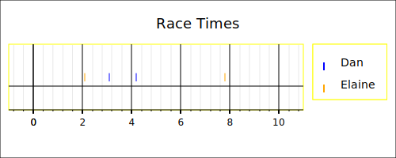</a>

<a href="./example/2d_bezier.cpp">./examples/2d_bezier.cpp

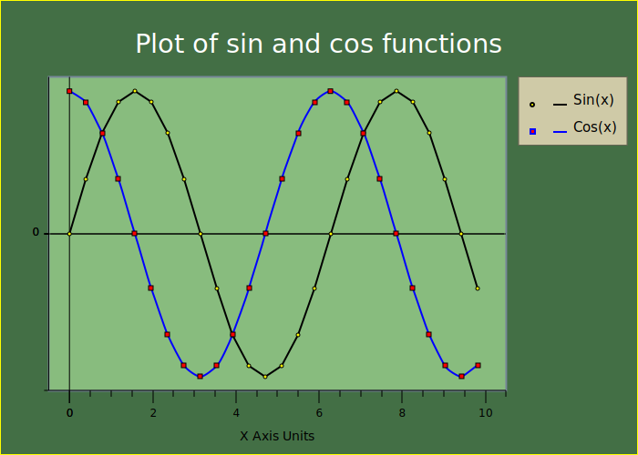</a>

<a href="./example/2d_full.cpp">./examples/2d_full.cpp

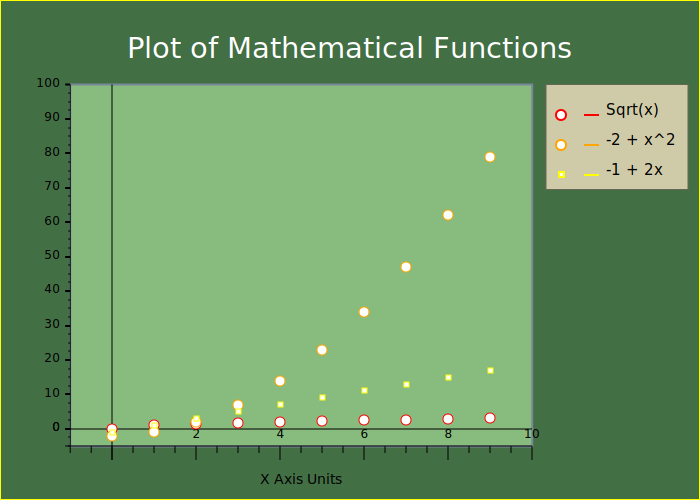</a>

<a href="./example/2d_limit.cpp">./examples/2d_limit.cpp

</a>

<a href="./example/2d_simple.cpp">./examples/2d_simple.cpp

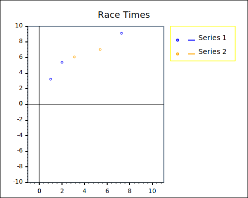</a>

<a href="./example/2d_y_grid.cpp">./examples/2d_y_grid.cpp

</a>

<a href="./example/auto_1d_containers.cpp">./examples/auto_1d_containers.cpp

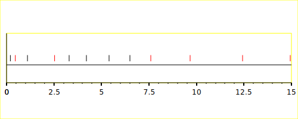</a>

<a href="./example/auto_1d_plot.cpp">./examples/auto_1d_plot.cpp

</a>

<a href="./example/auto_2d_plot.cpp">./examples/auto_2d_plot.cpp

</a>

<a href="./example/auto_boxplot.cpp">./examples/auto_boxplot.cpp

</a>

<a href="./example/boxplot_simple.cpp">./examples/boxplot_simple.cpp

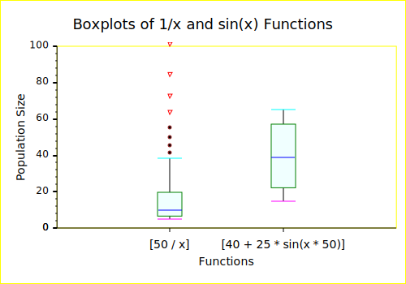</a>

<a href="./example/demo_1d_autoscaling.cpp">./examples/demo_1d_autoscaling.cpp

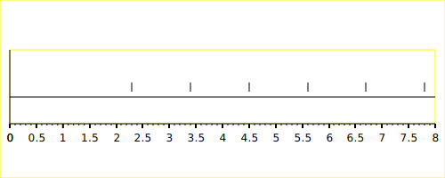</a>

<a href="./example/demo_1d_limits.cpp">./examples/demo_1d_limits.cpp

</a>

<a href="./example/demo_1d_plot.cpp">./examples/demo_1d_plot.cpp

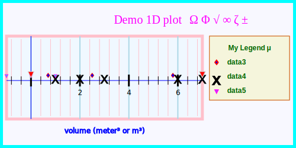</a>

<a href="./example/demo_1d_simple.cpp">./examples/demo_1d_simple.cpp

</a>

<a href="./example/demo_1d_uncertainty.cpp">./examples/demo_1d_uncertainty.cpp

</a>

<a href="./example/demo_1d_values.cpp">./examples/demo_1d_values.cpp

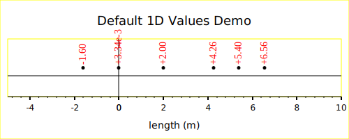</a>

<a href="./example/demo_1d_vector.cpp">./examples/demo_1d_vector.cpp

</a>

<a href="./example/demo_1d_x_external.cpp">./examples/demo_1d_x_external.cpp

</a>

<a href="./example/demo_2d_fonts.cpp">./examples/demo_2d_fonts.cpp

</a>

<a href="./example/demo_2d_limits.cpp">./examples/demo_2d_limits.cpp

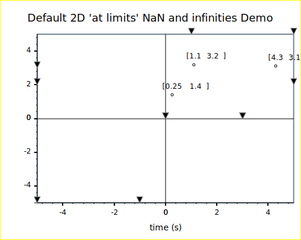</a>

<a href="./example/demo_2d_lines.cpp">./examples/demo_2d_lines.cpp

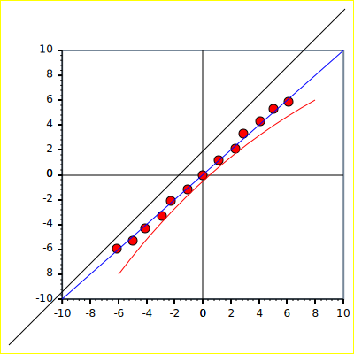</a>

<a href="./example/demo_2d_simple.cpp">./examples/demo_2d_simple.cpp

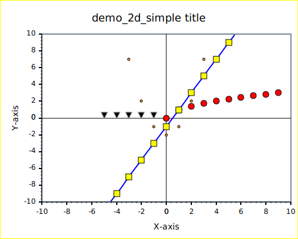</a>

<a href="./example/demo_2d_tick_values.cpp">./examples/demo_2d_tick_values.cpp

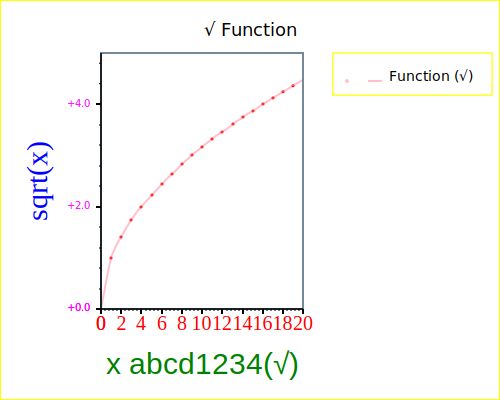</a>

<a href="./example/demo_2d_uncertainty.cpp">./examples/demo_2d_uncertainty.cpp

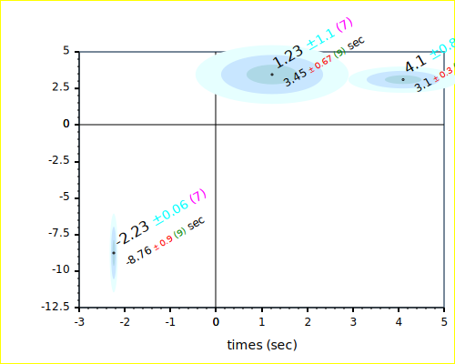</a>

<a href="./example/demo_2d_values.cpp">./examples/demo_2d_values.cpp

</a>

<a href="./example/demo_boxplot.cpp">./examples/demo_boxplot.cpp

</a>

<a href="./example/demo_color.cpp">./examples/demo_color.cpp

</a>

<a href="./example/demo_Hoaglin.cpp">./examples/demo_Hoaglin.cpp

</a>

<a href="./example/demo_point_markers.cpp">./examples/demo_point_markers.cpp

</a>

<a href="./example/demo_svg.cpp">./examples/demo_svg.cpp

</a>

<a href="./example/demo_svg_tspan.cpp">./examples/demo_svg_tspan.cpp

</a>

<a href="./example/svg_colors.cpp">./examples/svg_colors.cpp

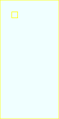</a>

<a href="./example/svg_test_boxplot.cpp">./examples/svg_test_boxplot.cpp

</a>

 
